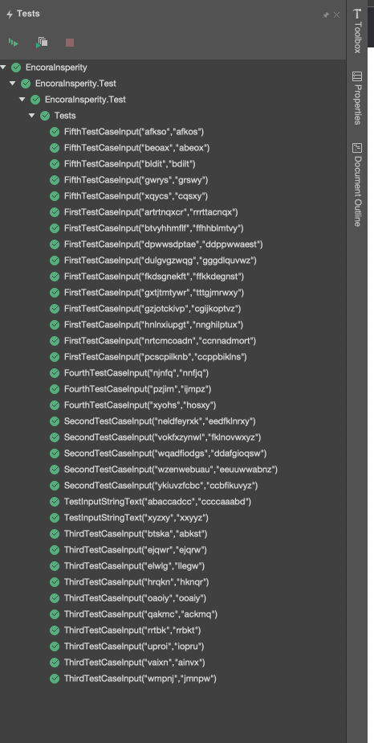

# String Manipulation: Sort of String

You are given N strings. For each string, perform the following sorting operations:

### 1.Rearrange the alphabets in the string in terms of frequency. i.e. the alphabet having greater frequency comes first. 

### 2. If two or more alphabets have the same frequency, the alphabet which is lexicographically small comes first.

Write a program to perform the above sorting operations.

## Note:

* The frequency of an alphabet is the number of times an alphabet appears in a string.
Example: Consider the string aabaac; here, the frequency of a is 3, frequency of b is 1, and frequency of c is 1.

* Lexicographic order is the way of ordering words based on the alphabetical order of English letters i.e. "a" is the smallest letter and "z" is the largest letter.

## Evidence: 

